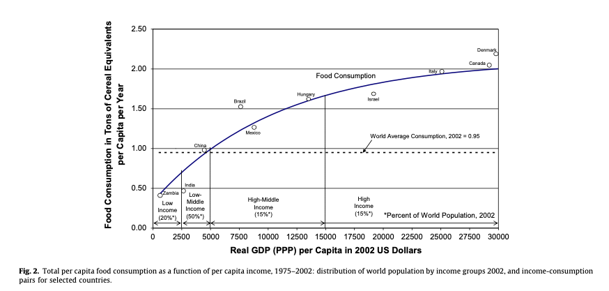

```{r setup, include=FALSE}
options(htmltools.dir.version = FALSE)
knitr::opts_chunk$set(
  fig.width=6, fig.height=3.5, fig.retina=3,
  out.width = "100%",
  cache = FALSE,
  echo = FALSE,
  message = FALSE, 
  warning = FALSE,
  hiline = TRUE,
  dev = "png", 
  dev.args = list(type = "cairo-png")
)

library(tibble)
library(ggplot2)
library(showtext)
font_add_google("Lato", "Lato")
font_add_google("Merriweather", "Merriweather")
theme_set(theme_minimal(base_family = 'Lato', base_size=16))
```

```{r xaringan-themer, include=FALSE, warning=FALSE}
library(xaringanthemer)


colores <- c(celeste="#5e82ae", 
             color3="#89a2c3",
             color1="#698BB4",
             color2="#5D81AD",
             verde="#4E7B7B")

# ,,5D81AD,,000000
style_mono_accent(
  base_color = "#5e82ae",
  #secondary_color = "",
  header_font_google = google_font("Lato"),
  text_font_google   = google_font("Merriweather"),
)
```


# Elasticidad precio de la Demanda


---
# Elasticidad Precio de la Demanda


- Ya sambemos que si el precio sube la cantidad demandada baja, la elasticidad precio de la demanda ( $E_p$ ) cuantifica esa caída.

- Mide __cuánto__ cambia la cantidad demandada cuando cambia el precio.

- Se calcula como el valor absoluto del cociente entre la variación porcentual en la cantidad y la variación porcentual en el precio:

$$ E_d = | \frac{ \Delta Q\%}{\Delta P \%} |$$

---
# Elasticidad Precio de la Demanda (2)


- La elasticidad de la demanda de un bien depende de varios factores:

  - Si el bien tiene muchos **sustitutos**, su demanda va a ser más elástica.
  
  - Si tomamos un **plazo de tiempo** largo, la demanda del bien es más elástica, porque los consumidores se ajustan mejor en el largo plazo.
  
  - Los **bienes de lujo** tienen demanda más elástica que los bienes de necesidad básica.

---
# Elasticidad Precio de la Demanda (3)


  - Si $E_p = 1$ el bien tiene **elasiticidad unitaria**. Eso implica que un cambio en 1% en el precio del bien implica un cambio de 1% en la cantidad demandada de ese bien.
  
  - Si $E_p > 1$ el bien tiene **demanda elástica**, un cambio de 1% en el precio del bien implica un cambio mayor a 1% en la cantidad demandada del bien.
  
  - Si $E_p < 1$ el bien tiene **demanda inelástica**, un cambio de 1% en el precio del bien implica un cambio menor a 1% en la cantidad demandada del bien.


---

# A tener en cuenta:

  - Usamos cambios porcentuales y no absolutos. Esto permite comparar elasticidades de distintos productos, y hace que los cálculos sean independientes de las unidades de medida.
  
  - Para calcular la variación porcentual, usamos el promedio del valor inicial y el final como denominador.

$$ \Delta P\%\ = \frac{\Delta P}{(P_0 + P_1) / 2}$$
Donde $\Delta P$ es la variación absoluta de $P$ ( $P_1 - P_0$ ), $P_0$ es el precio inicial y $P_1$ el precio final.

- Si no usamos valor absoluto, la elasticidad sería negativa.


---
# Ejemplo Numérico


.pull-left[
```{r fig.height=5}

library(polynom)

dem <- tibble(
  q=c(160, 200, 240),
  p=c(110, 100, 90),
  lab=c("B", "", "A")
)


dem_p <- poly.calc(dem$q, dem$p) %>% 
  as.function

ggplot() + 
  geom_function(fun=dem_p, xlim=c(120, 280), size=1) +
  geom_point(data=dem, aes(x=q, y=p)) +
  # Etiquetas para los puntos
  geom_text(aes(x=q+10, y=p+10, label=lab), data=dem) +
  scale_x_continuous(breaks=seq(0, 360, by=40)) + 
  scale_y_continuous(breaks=seq(0, 200, by=10)) + 
  expand_limits(y=c(0, 150),
                x=c(0, 360)) + 
  # Eje Y
  geom_segment(aes(x=0, y=0, xend=0, yend=150)) + 
  # Eje X
  geom_segment(aes(x=0, y=0, xend=360, yend=0)) + 
  # Highlight points
  geom_segment(aes(x=0, y=90, xend=240, yend=90), alpha=.6) +
  geom_segment(aes(x=0, y=110, xend=160, yend=110), alpha=.6) + 
  geom_segment(aes(x=240, xend=240, y=90, yend=0), alpha=.6) +
  geom_segment(aes(x=160, xend=160, y=110, yend=0), alpha=.6) +
  labs(x="Q", y="P")
```

]

.pull-right[
- El precio pasa de 90 a 110.

- La cantidad pasa de 240 a 160.
]


---

# Ejemplo


### Variación absoluta

- La __variación absoluta__ del precio es 20.

- La __variación absoluta__ de la cantidad es 80.

- La __variación porcentual__ del precio es 20%. $(\frac{20}{\frac{90+110}{2}})$

- La __variación porcentual__ de la cantidad es 40% $(\frac{80}{\frac{160+240}{2}})$.


---
# Casos extremos

```{r}
ggplot() + 
  geom_segment(aes(x=20, y=100, xend=300, yend=100), size=1) +
  geom_segment(aes(x=200, y=0, xend=200, yend=200), size=1) +
  scale_x_continuous(breaks=seq(0, 360, by=40)) + 
  scale_y_continuous(breaks=seq(0, 200, by=20)) +
  annotate("text", x=240, y=180, label="Demanda\ninelástica") + 
  annotate("text", x=80, y=80, label="Demanda elástica") + 
  
  coord_fixed() +
  expand_limits(y=c(0, 200),
                x=c(0, 360)) + 
  # Eje Y
  geom_segment(aes(x=0, y=0, xend=0, yend=200)) + 
  # Eje X
  geom_segment(aes(x=0, y=0, xend=360, yend=0)) + 
  labs(x="Q", y="P")

```


---
# La elasticidad y los ingresos de las empresas

- Si hay un aumento en la oferta, baja el precio ( $P$ ) y sube la cantidad ( $Q$ ).

- ¿Qué pasa con el ingreso de las empresas ( $P \times Q$ )?

- Depende de la elasticidad de la demanda.

---
# Elasticidad e ingresos


---

# Elasticidad e ingresos

- Si la demanda es elástica, el aumento en $Q$ va a ser mayor que la caída en $P$, por lo que el ingreso total $P \times Q$ sube.

- Si la demanda es inelástica, el aumento en $Q$ va a ser menor que la caída en $P$ y el ingreso total $ P\times Q $ cae.

- Si la elasticidad es unitaria, $Q$ cae en la misma proporción que $P$ sube.


---
# Elasticidad Ingreso del combustible


---
# Elasticidad Ingreso de la demanda de combustibles

- El quintil más pobre de los hogares Uruguayos gasta 3,9% de sus ingresos en combustible.
- El quintil más rico gasta 4.9%.
- Cuando aumenta el ingreso, la participación de los combustibles en el prespuuesto total aumenta.
---

# Elasticidad Ingreso de la demanda de alimentos



---
# Elasticidad Ingreso de los Alimentos

- A medida que los países se hacen más ricos, su gasto en alimentos aumenta, pero la participación de los alimentos en el gasto total decrece.

---
# Efecto de un impuesto

- Incidencia legal vs. incidencia económica

- A veces los productores pueden trasladar todo el peso del impuesto a los consumidores.

- Depende de las elasticades relativas de oferta y demanda.

---
# Análisis económico


---
# Análisis económico (2)

- El equilibrio inicial es con un precio de $2 y 100 billones de galones vendidos.

- El impuesto hace que la oferta se desplace hacia la izquierda por $2.

- Esto se debe a que ahora los productores tienen que recibir $2 más por galón para producir la misma cantidad que antes.

- El nuevo equilibrio (E'), el precio es $3.8 y la cantidad 80 billones de galones. De esos $3.8, los productores reciben $1.8 y pagan $2 de impuestos, pero lograron trasladar la mayor parte de la suba a los consumidores.


